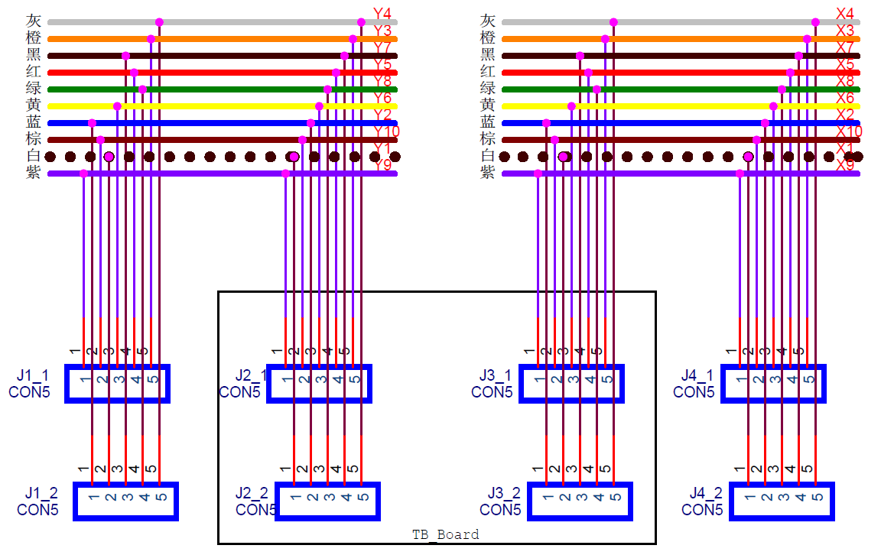

# 版本
2020-5-12 初稿

# 模块参数表

|项目|描述|
|---|---|
|托盘尺寸|托盘PCB尺寸：72*175mm PCB模组架型号：JUM72 (采购时需提供PCB长) PCB模组架规格：89.6*175*39mm |
|支持模块数量|3（左[屏幕或其他]，中间[主控]，右[接口板]）|
|模块连接方式|模块与托盘：2.54mm间距排针、排母 模块与模块：板载RJ48走线 磁吸供电 
|输入电压|直流5V|
|输入电源接口|2.54mm间距螺丝式接线端子 MicroUsb，垂直插入 1.6mm孔径直流插座 
|保护电路|过压保护，过流保护|

# 模块原理图
## 供电接口

## 过压保护

## 板上互联接口线序

# Layout图

